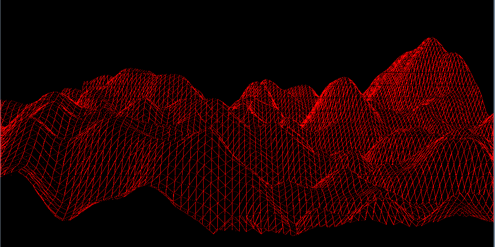
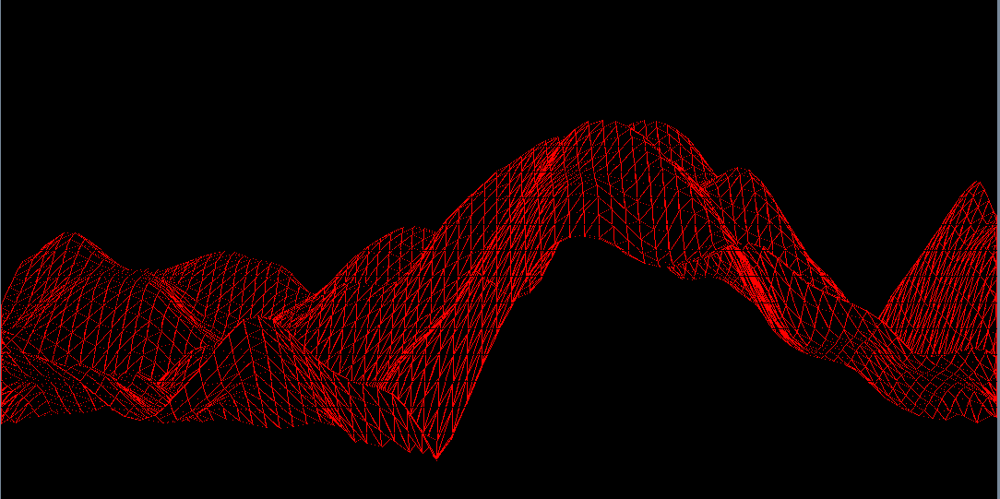

# Procedural Terrain Generator

This generates terrain using perlin noise from scratch (i.e putpixel). 

The Graphics algorithms used:
  - BLA line drawing algorithm
  - Surface filling algorithm
  - 2D clipping algorithm
  - Z-buffer algorithm

## Dependencies
  - SFML
  - cmake
  - g++ or any c++ compiler

## Building the project

```bat
git clone git@github.com:adh-aashish/terrain-generation.git
cd terrain-generation
mkdir build
cd build
cmake ../
make
cd project/src
./myproject
```

The wireframe result :<br>



Clipping result:<br>



